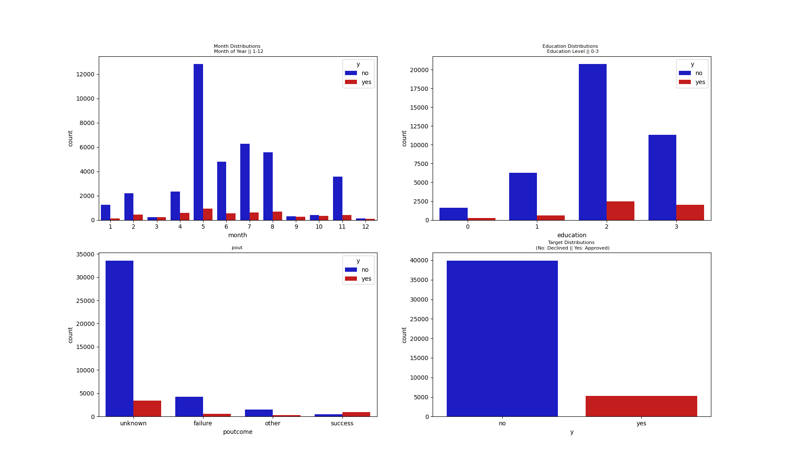
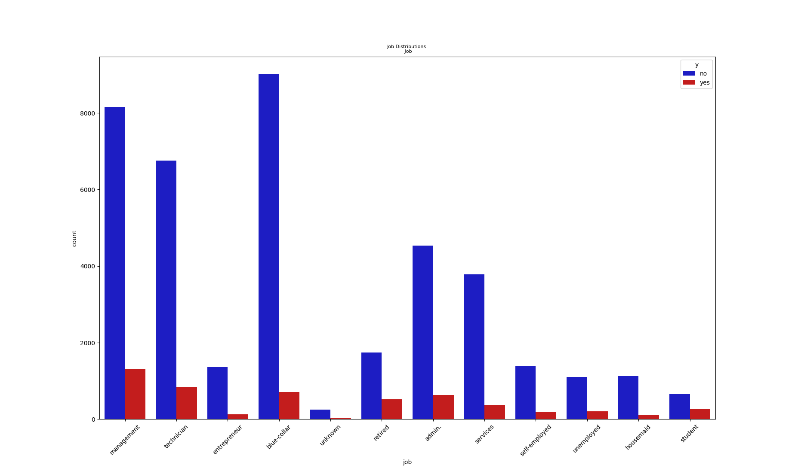
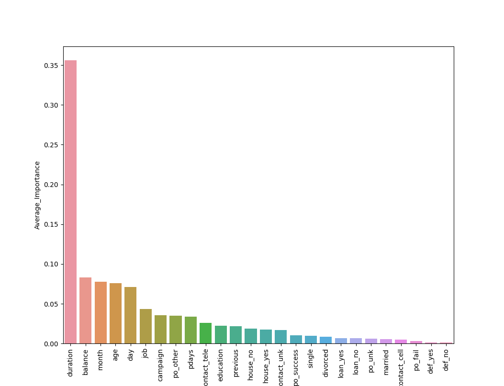
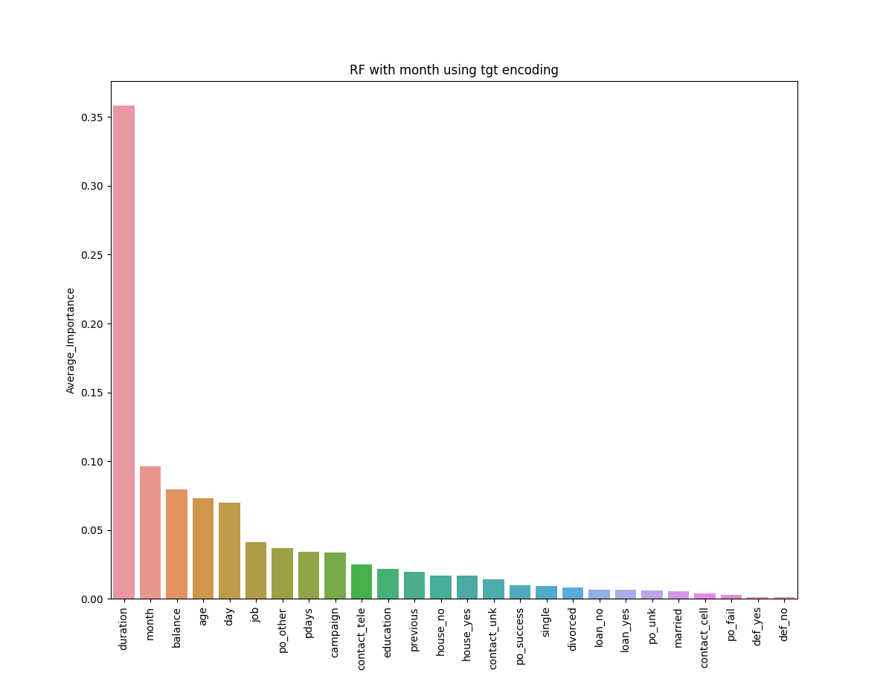
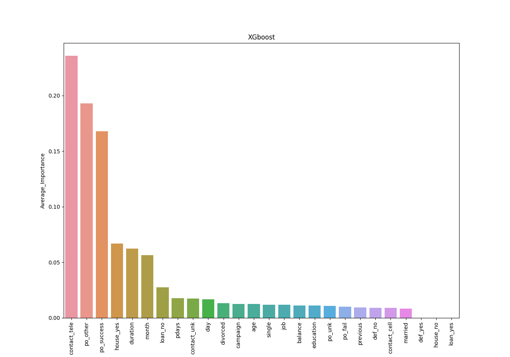

# ixhw

## CODE:

First run:  ixis_diag.py to produce charts, EDA, etc.

Main run: ixis_run.py to run models.

There are several steps to my project:

* EDA - done
* Random Forest Model - done
* Boosting Model - done
* Neural Network Model - PyTorch TabNet with categorical embeddings - next project

# EDA
Objectives:
* Identify missing data, if any
  * Impute accordingly
* Examine all "object" data types within dataframe for anomalous values
* Examine categorical input data
  * Cardinality
  * Evalute encoding options for each categorical field: Ordinal, OHE, Target Encoding, and Embedding (for NN)
* Examine target data for imbalance
* Examine input data for imbalance

Outcomes of EDA:
* No missing data
* "Objects" in dataframe had no anomalous values 
* Used ordinal encoding for 'month' and 'education' fields
  * Made 'sense' for a tree model:  data looked like it could split, nicely, in ordinal manner.  
* Used OHE for: 'marital','default', 'housing', 'loan', 'contact'
* Used cross-validated target encoding for 'job'
* Target data highly imbalanced:  roughly 89%/11%
* Some input data extremely imbalanced: default data 98% negative and 2% positive.  Some jobs in 'job' and also some months in 'month' were also very rare.

# Imblearn RF Classifier v1
* Use RF to try and learn features without lots of tuning/parameter optimization - good for comparison, later.
* Maybe get lucky and have a good model (not in our case!)
* Use imblearn BalancedRandomForest classifier in conjuction with sklearn RepeatedStratifiedKfold cv.
* Had to hand-code train-test loop for cv mean target encoding or else would have to edit and test new objects within API - hence, no pipelines, etc.
* Expectation was that between the model and the repeated, stratified, and random cross-validation, my fitted model would capture at least some of the lower-frequency data.
###Performance:
F1            Precision          Recall
0.54          0.41               0.89
* The BalancedRandomForest model identified 'duration' as the most important feature.
* I want to find the most important feature using a NN and contrast/compare them.

* It is entirely possible that my ordinal encoding of 'month', or other ordinal or OH encodings, caused serious performance issues with the balanced RF.  

# Imblearn RF Classifier v2
* Using what I learned from v1, encode 'month' using target encoding.
* All other settings the same as in v1.
###Performance:
F1            Precision          Recall
0.56          0.41               0.89

# XGBoost
* we get the best f1 results with a weight of 10.  This makes sense, since no/yes is close to 10 in our data for subscriptions.
* If we make turn weights way-up, we just overfit positive results.
* Use same encoding scheme as in RF v2.
* We still get better f1 score than from Balanced RF.
###Performance
F1            Precision          Recall
0.62          0.67               0.96
*{'W': 10}    {'W': 1}          {'W': 1000}
* Final Result with W = 10:
F1            Precision      Recall
0.60          0.46           0.84

## Feature Importance Order for XGBoost, W=10, repeated stratified 5-fold cv:

Idx_|feature_name___|__importance______
----|---------------|------------------       
21 | contact_tele   |        0.235742
24 |     po_other   |        0.194642
25 |   po_success   |        0.166917
15 |    house_yes   |        0.064893
6  |     duration   |        0.062216
5  |        month   |        0.056394
17 |      loan_no   |        0.028360
8  |        pdays   |         0.017808
19 |  contact_unk   |        0.017380
4  |          day   |        0.016819
0  |          age   |         0.012502
12 |     divorced   |         0.012399
7  |     campaign   |         0.012391
11 |       single   |         0.012087
1  |          job   |         0.011967
2  |    education   |         0.010924
3  |      balance   |         0.010889
22 |       po_unk   |         0.010695
23 |      po_fail   |         0.010510
9  |     previous   |         0.009619
20 | contact_cell   |         0.008679
10 |      married   |         0.008087
13 |       def_no   |         0.008080
14 |      def_yes   |         0.000000
16 |     house_no   |         0.000000
18 |     loan_yes   |         0.000000

## XGboost importance vs RF
* XGBoost identified completely different variables than RF for importance.
* Because of XGBoost's superior f1 score and precision, it is likely RF overfit on its important variables during training, whereas XGBoost did not (as much).

# Pytorch TabNet - TBD - future project
Initial Architecture:
* KISS:  single layer for first model - this isn't image processing. Add layers, as needed.
* Represent all categorical variables with cardinality > 4, including date and month, as embeddings to be learned by network.
 * Remaining categorical variables would be OHE
* Standardize numerical inputs.
